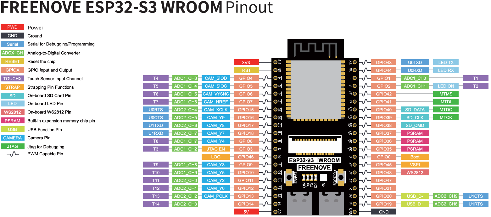

# FmmiIot

### Esp32-s3 WROOM

### Libraries
- [RTClib](https://docs.arduino.cc/libraries/rtclib/)
- [ArduinoJson](https://arduinojson.org/)
- [DHT sensor library](https://docs.arduino.cc/libraries/dht-sensor-library/)
